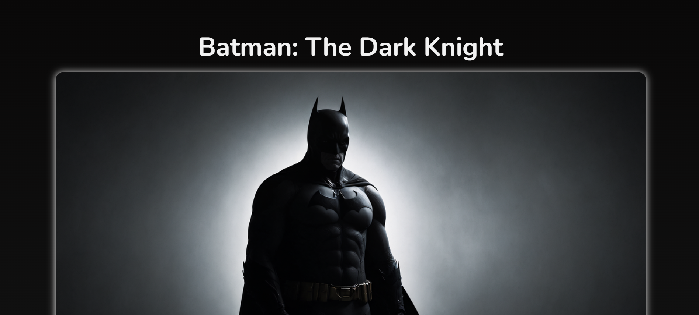

# 📁 Tribute Page

## ℹ️ Batman: The Dark Knight Tribute

A tribute page dedicated to one of the most iconic superheroes in comic book history — Batman. This page highlights his achievements, story, and the enduring legacy he holds in the DC Universe.

It was built entirely with HTML and CSS as part of the [**freeCodeCamp.org**](https://www.freecodecamp.org/learn/full-stack-developer/) CSS course.

---

## 🔍 Overview

This project showcases a single-page tribute layout that presents structured content using semantic HTML5 elements. The page features a main banner, multiple illustrated achievements, a closing quote, and an external source link for further reading.

The styling was done entirely with custom CSS, featuring modern design techniques such as CSS variables, custom Google Fonts, box shadows, hover transitions, and a fixed dark-themed background.

---

## ✨ Features

- Fully responsive layout with modern design principles
- Scroll-smooth behavior for better UX
- Semantic HTML5 structure for accessibility and SEO
- Dark theme using CSS custom properties
- CSS hover effects on images and links
- External links with `target="_blank"` for safe navigation
- Image captions and blockquote usage for rich storytelling
- Clean, structured CSS using BEM-like sections and utility classes

---

## 🧠 What I Learned

- How to structure content using semantic HTML elements like `<main>`, `<section>`, `<figure>`, `<figcaption>`, and `<blockquote>`
- Creating smooth and responsive layouts with `clamp()`, flexbox spacing, and percentage-based width
- Applying consistent spacing using custom CSS variables for margin and padding
- Styling interactive elements with transitions and shadows
- Organizing and maintaining a clean stylesheet with utility classes and variable-driven design
- Enhancing accessibility with descriptive alt texts and clear typography

---

## 🛠️ Tech Used

- HTML5
- CSS3

---

## 🚀 How to Run

1. Clone the repository
2. Navigate to this project folder
3. Open `index.html` in your browser

---

## 🌐 Live Demo

Or you can check out the 👉 [live website here](https://html-css-daily.netlify.app/build%20a%20tribute%20page/)

---

## 🧑‍💻 Author

Created by **Elmar Chavez**

🗓️ Month/Year: **May 2025**

📚 Journey: **2nd** month of learning _frontend web development_.
